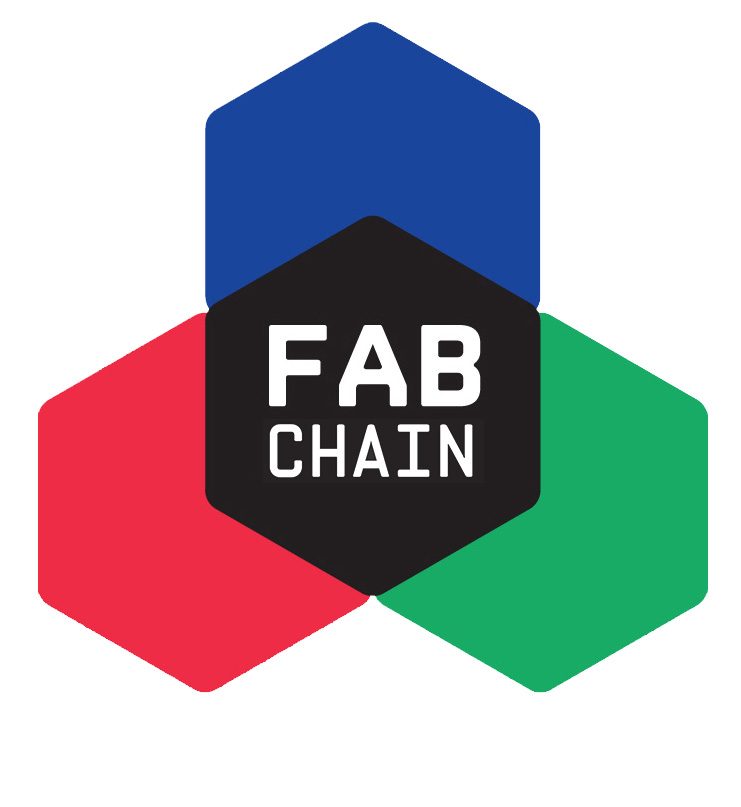

# Web3 playground

Welcome hackers!

Feel free to play around with FABT using Metamask, upload and operate
your Solidity smart-contracts using Remix. Money is not required, just
tap into the [FABT testnet faucet](http://test.fabchain.net:5000/) to
receive one coin per address per day.

To get in touch, [join the Fabchain telegram group](https://t.me/+a1cMevbmi2o3MDQ8).

# FABT Testnet

Current status: **FREE FOR ALL!**

- Network name: `FABT`
- Chain id: `1717658228`
- Currency symbol: `fabt`
- Faucet: http://test.fabchain.net:5000/
- New RPC Url: http://test.fabchain.net:8545/
- Explorer: http://test.fabchain.net:8000/#/

## Testnet disclaimer

This service is offered in the hope that it will be useful, but
WITHOUT ANY WARRANTY; without even the implied warranty of RELIABLE
SERVICE PROVISION or FITNESS FOR A PARTICULAR PURPOSE. The FABT
testnet may be reset and/or forked at any time without notice.

# FAB Network

Current status: **WORK IN PROGRESS**

Supported Interfacer by [Fabcity Hamburg](https://fabcity.hamburg)

  

